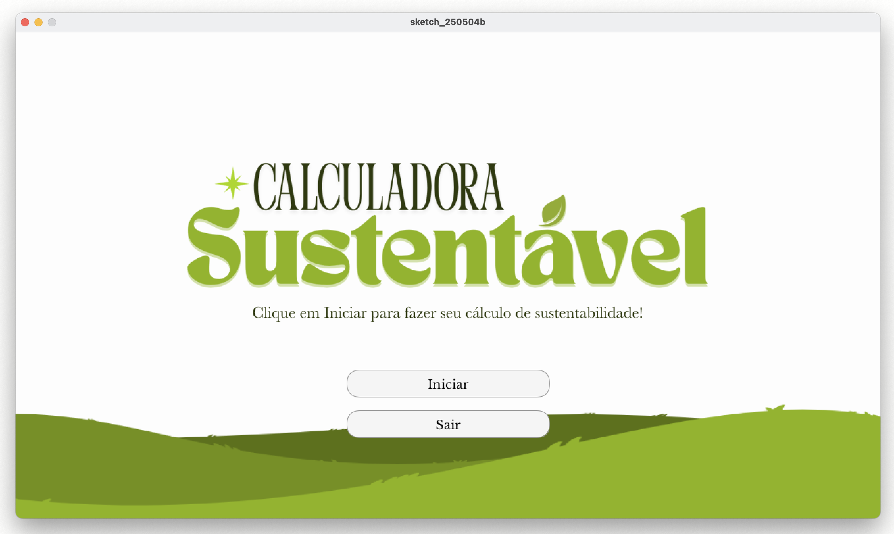
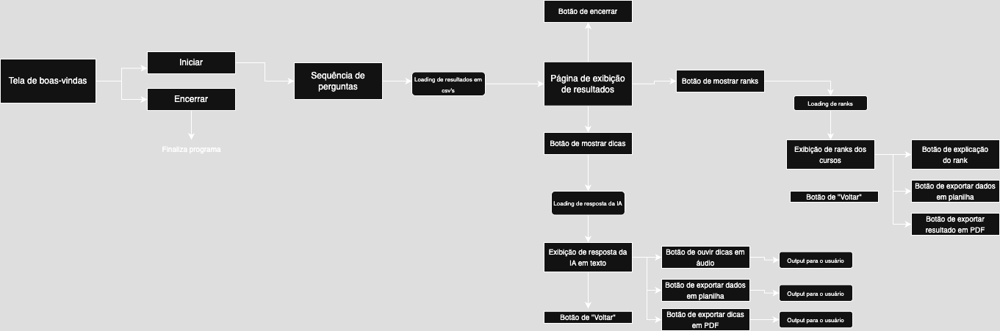

# Calculadora Sustentável

Calculadora sustentável é um programa que mede o nível de sustentabilidade de cada curso universitário com base em critérios ambientais, sociais e econômicos. A aplicação gera relatórios personalizados, oferece sugestões de boas práticas e conecta professores, alunos e gestores em torno de ações sustentáveis.

## Tela inicial

## Demo

## Diagrama inicial de planejamento

## TO-DO Roadmap (código):

#### Inputs
- [x] Pegar input do usuário
- [x] Armazenar input em csv
- [x] Criar botão de Exibir resultados após finalizar input

#### Aparência do projeto
- [x] Definir dimensões ideais
- [x] Escolher fonte e identidade visual
- [x] Projetar telas minimamente boas

#### Cálculos e resultados dos inputs
- [x] Fazer cálculos com base no input salvo no csv
- [x] Salvar resultado do usuário no mesmo CSV em campos adicionais

#### Resultados
- [x] Retornar ao usuário de forma básica na tela os resultados (após ele clicar no botão)
- [x] No fim da tela de resultados, exibir novos botões:
        1. Dicas para deixar sua rotina mais sustentável

#### Botões finais
- [x] Se o usuário clicar no botão 1, chamar um modelo de iA para dar dicas baseadas no input. Implementado localmente com um modelo open-source

#### Multimídia
- [x] Exportação dos resultados em PDF
- [x] Exportação dos resultados em planilha

#### Exibir projeto na web
- [x] Verificar como indexar projeto na web através de plugin
- [x] Implementar página web simples para exibição (quebrar essa task em mais no futuro, css, html etc)

Verificado. A única opção aqui seria exportar o projeto para p5.js posteriormente. Podemos perguntar ao professor se é permitido.

## TO-DO Roadmap (projeto em geral):

#### Dados
- [x] Pensar em quais perguntas deveremos usar
- [ ] Criar um documento explicando cada cálculo/ranqueamento usado referente as perguntas feitas ao usuário.
    Exemplo: Explicar como chegamos no cálculo de que se o usuário andar de carro sozinho, ele tem um gasto de 0.27 de CO2 por km. Esse dado, por exemplo, vem da EMBRAPA.
- [x] Criar um cálculo correto para cada input do usuário com base em dados coletados na tarefa anterior
- [x] Bases de dados para consultar e nos basear: EMBRAPA, ONU, CETESB, SEEG
    O SEEG será usado somente no final, para comparação, exemplo: “Com suas escolhas hoje, você gerou 3.2 kg de CO₂. Isso representa 0.00001% das emissões diárias médias por pessoa no Brasil segundo o SEEG.”

#### Apresentação
- [x] Pensar em nome do projeto
- [x] Criar apresentação do nosso projeto
